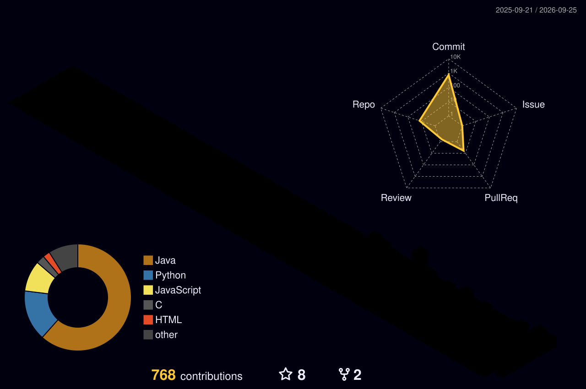

# TTlook111 | Java Backend × LLM Agent

> 🇨🇳 中文 / 🇺🇸 English（双语） · Privacy-safe GitHub Profile README

  
   
  

  
  

<b>目录 / Table of Contents</b>

- [👋 简介 | Intro](#-简介--intro)
- [🧰 技术栈 | Stack](#-技术栈--stack)
- [🧱 项目 | Projects](#-项目--projects)
- [🏆 Highlights | 亮点](#-highlights--亮点)
- [📊 Stats | 统计](#-stats--统计)
- [🧊 3D Contrib | 3D 贡献图](#-3d-contrib--3d-贡献图)
- [🐍 Snake | 蛇形贡献图](#-snake--蛇形贡献图)
- [🤝 联系我 | Contact](#-联系我--contact)

---

## 👋 简介 | Intro

**中文**
- Java 后端方向，学习与实践 **LLM Agent / RAG / 工作流编排（LangChain / LangGraph）**。
- 目标：把学习仓库持续打磨成更工程化、更可复用的 Agent 项目。

**EN**
- Java backend developer learning **LLM agents, RAG, and workflow orchestration (LangChain / LangGraph)**.
- Goal: evolve learning repos into reusable, production-oriented agent projects.

---

## 🧰 技术栈 | Stack

  

---

## 🧱 项目 | Projects

  <!-- 用 GitHub 官方 OpenGraph 卡片：比第三方 pin 卡片更稳定，不容易裂图 -->
  
  

**中文**
- **assistant-agent**：基于 LangGraph 的多智能体个人助理（Human-in-the-Loop + SQLite 持久化）。
- **vacuum-agent**：基于 LangChain + ReAct 的扫地机器人智能客服 Agent（结合 RAG 做知识问答）。

**EN**
- **assistant-agent**: LangGraph-based multi-agent assistant (Human-in-the-Loop + SQLite persistence).
- **vacuum-agent**: LangChain + ReAct vacuum customer-support agent (RAG for knowledge Q&A).

---

## 🏆 Highlights | 亮点

- ✅ **Agent Workflow / 工作流编排**：Tools、State、Branch & Loop control（LangGraph 思路）。
- ✅ **RAG Pipeline / RAG 流水线**：Chunking → Retrieval → Rerank → Prompt → Evaluation（持续迭代）。
- ✅ **Engineering / 工程化**：Logging、Tracing、配置化路由、失败重试/降级策略（更像可用系统）。

---

## 📊 Stats | 统计

  

  

---

## 🧊 3D Contrib | 3D 贡献图

> 需要 Actions：添加 `profile-3d.yml` 后会自动生成到仓库目录 `profile-3d-contrib/`。

  

---

## 🐍 Snake | 蛇形贡献图

> 需要 Actions：添加 `snake.yml` 后会生成到 `output` 分支。

  

---

## 🤝 联系我 | Contact

- Email: **2725077832@qq.com**

  

